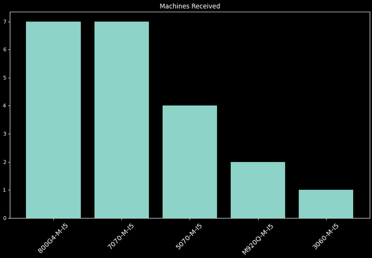
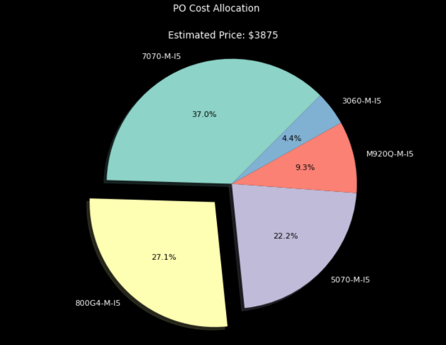
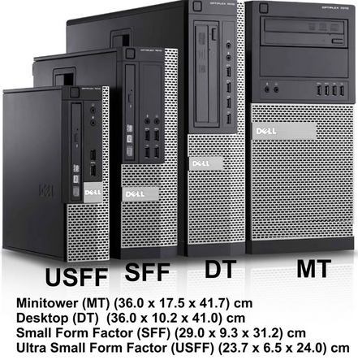
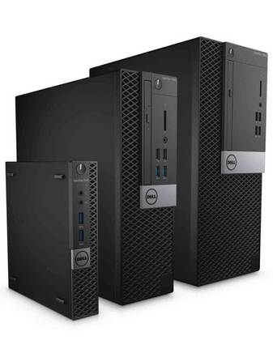

# Machines Received

## Automate purchase order data visualizations
---
## Project Overview:
- Imports raw price data and cleans
- Imports purchase order data and cleans
- Merges dataframes 
- Produces useful information about purchase orders
- Generates two visualizations:
  - Bar graph of machine types received by total units
  - Pie chart of which models account for total cost
---
**Code and Resources Used**
 - Python 3.9
   - _Pandas_
   - _Matplotlib_
 - From the command line, input `pip install -r requirements.txt` from project directory to add required modules.
---
### **The Basics:**
A jupyter notebook that takes data from a purchase order and processes it to display relevant information. This code is not specific to one CSV, but is scalable to all CSV files generated in this format. An export tool within my workplace's website generates these CSVs with consistent formatting, and column titles are the main data manipulation methodology used.
---
---
### ***Project Features:***
1. Read in data from a local csv
2. Use built-in python, pandas, functions/lambdas to manipulate data
3. Analyze with built-in python/pandas and custum functions
4. Make basic plots with matplotlib
5. Markdown cells in Jupyter Notebook explaining throught process and code
---
### **In Detail:**
 A cost basis CSV is first cleaned to be universally applicable to machines in their receiving format. Data from a received purchase order is then imported, cleaned, and made into a dataframe visualizing its makeup by number of machines. Cost values from the cost basis CSV are then merged to create a visualization breakdown by model. The machines are then totaled by value using the averaged price, and a second visualization displays the projected average cost, along with a percentage representation of each model received.
---
---
#### *Sample Visualizations*:

---
---
##### This final project for Code Kentucky Data Analysis I is a continuation of my functional work program [ninjascripts](https://github.com/keith-flynn/ninjascripts/). My latest edition includes a file browser GUI to select which .csv file to import, and a section which automatically copies all of the serial numbers to the [system agnostic] operating system's clipboard. Both of these critical work functions are inoperable from within a jupyter notebook and had to be culled in order to operate properly. 
> The machines-received repository is a "soft" fork of [ninjascripts](https://github.com/keith-flynn/ninjascripts/) and maintains the original upstream version's history.
---
##### **Machine form factors from smallest to largest:**
##### (**M**)ini, (**U**)ltrasmall, (**S**)mall,  (**D**)esktop, (**T**)ower
##### *- First image: Ultrasmall, Small, Desktop, and Tower models 2009-2012*
##### *- Second image: Mini, Ultrasmall, Small models 2012-2020*
---

---
---
## License
[GNU GENERAL PUBLIC LICENSE](LICENSE)