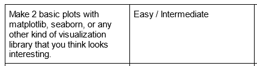

# Requirement Fulfillment:
## [Project README found here.](README)
---
## 1. Read Data In

---

---

## 2. Manipulate and Clean Your Data

---

---

## 3. Analyze Your Data

---

The last four examples are all from the same cell.

---

## 4. Visualize Your Data

---

---

## 5. Interpret Your Data

---

